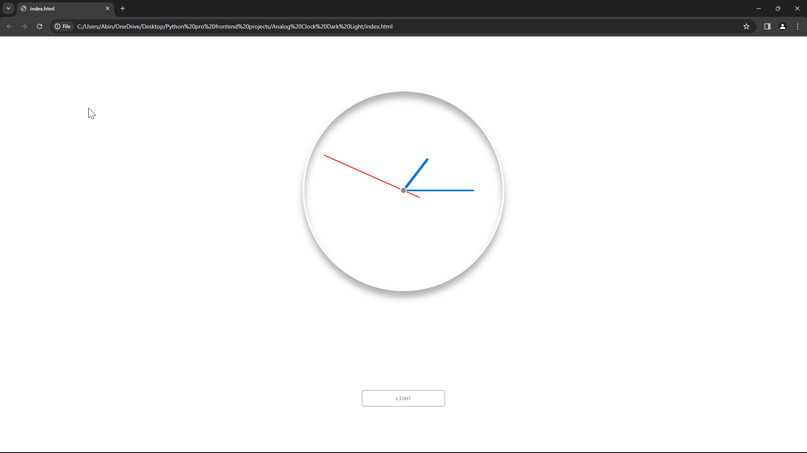
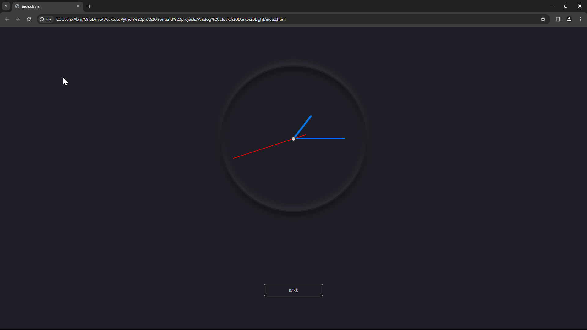

# Analog-Clock-
Analog clock using Python, CSS, and JavaScript. 

🌟 Exciting Python, CSS, and JavaScript Project:

Dive into the world of web development with my latest project! I've crafted a captivating analog clock using Python, CSS, and JavaScript. This project showcases my proficiency in front-end technologies and my ability to integrate them seamlessly.

⏰ Analog Clock:

Experience time in a visually stunning way with my analog clock. It's not just a functional timepiece; it's a testament to my creativity and attention to detail. The clock features hour, minute, and second hands that move gracefully, providing a dynamic and engaging user experience.

🎨 Customizable Themes:

But wait, there's more! With just a click, users can toggle between light and dark themes, changing the background color to suit their preference. This feature demonstrates my versatility in design and implementation, catering to diverse user needs and preferences.

